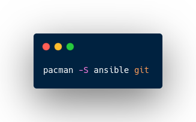
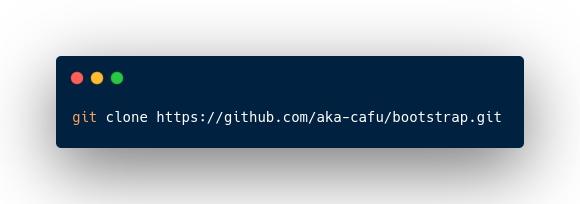
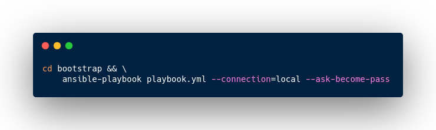

## Bootstrap

This repository contains _the setup_ configurations that I use in my daily routine.

I use [Arch Linux](https://archlinux.org) as my main distribution, but you **can** use this playbook on any Arch Linux [based distros](https://wiki.archlinux.org/title/Arch-based_distributions#Active)

### Installation

To run the playbook, first, you need to install **ansible** and **git**

To use the [from_aur](https://github.com/aka-cafu/bootstrap/tree/main/roles/from_aur) role, you will need the [yay](https://github.com/Jguer/yay#installation) package to proceed.

<!-- ```bash
$ pacman -S ansible git
``` -->


Then clone this repository:



<!-- 
```bash
$ git clone https://github.com/aka-cafu/bootstrap.git
``` -->

After the clone, execute the playbook (typing your password), then wait until the ansible finishes all tasks.



<!-- ```bash
$ cd bootstrap && \
    ansible-playbook playbook.yml --connection=local --ask-become-pass
``` -->